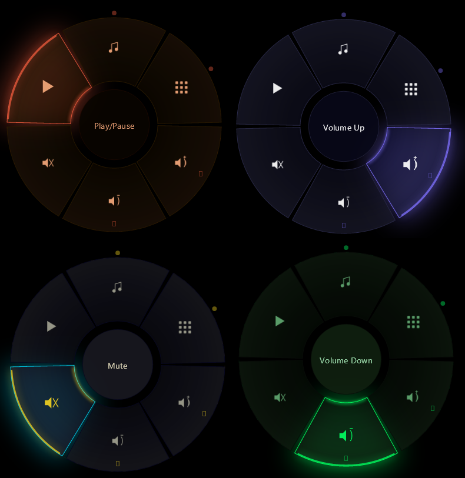

# AeroDial

**A radial launcher overlay for Windows.**

[](LICENSE)
[](https://github.com/mmatul06/AeroDial)
[](https://dotnet.microsoft.com/)


AeroDial opens a customisable radial menu wherever your cursor is, triggered by any key or mouse button, letting you launch apps, fire key combos, control media, paste clipboard snippets, and navigate nested submenus without touching your taskbar. It works on top of any application including fullscreen games, across any number of monitors at any DPI scale.

---
## Screenshots



---

## Features

### Trigger
- Any keyboard key, mouse button or modifier combo
- Hold mode: hold to show, release to select
- Toggle mode: press to open, press again (or click) to close
- Modifier filter: only trigger when Ctrl, Shift, Alt, or Win is held

### Menu
- Radial ring with 4-12 slices per level
- Nested submenus: hover a submenu slice to expand a child ring; center-click to go back
- Empty slice slots rendered at reduced opacity so the ring always looks complete
- Configurable center gap (0-40 px) to detach slices from the inner ring

### Selection modes
- Hover dwell: cursor dwell time triggers the action
- Click: left-click a slice
- Flick: cursor angle from center determines the aimed slice; execute on trigger release or second press

### Actions

| Action | Description |
|---|---|
| Launch app | Start any executable with optional arguments |
| Open URL | Open any URL in the default browser |
| Key combo | Send any keystroke combination (e.g. Win+D, Ctrl+Shift+T) |
| Media | Play/Pause, Next, Previous, Volume Up/Down, Mute |
| Run script | Execute .bat or .ps1 scripts |
| Paste clipboard | Set clipboard text and paste it |
| Submenu | Open a nested child ring |
| Focus window | Bring an open window to the foreground |

### Dynamic submenus (built automatically, no setup needed)
- **Active Tasks** (`__active_tasks__`) -- live list of open windows with per-app icons, rebuilt on every open
- **Clipboard History** (`__clipboard_history__`) -- up to 8 recent clipboard text entries

### Visuals
- Radial gradient fills, blur glow on hover, inner accent arc
- 11 built-in themes: Obsidian, Ember, Midnight Teal, Chalk, Neon, Cyberpunk, Ocean, Sunset, Matrix, Arctic, Sakura
- Full custom theme support: JSON files in `%AppData%\AeroDial\themes\`
- Theme Editor in Settings: create themes with 17 color fields and color-picker flyouts
- Smooth ease-out open/close animations; respects Windows animation preference
- Per-pixel transparency via DWM

### Scroll wheel
- Scroll wheel captured while overlay is open
- Each slice can bind scroll-up and scroll-down to independent media actions (volume, track, etc.)

### Input icons
- 40+ built-in programmatic icons (white, tinted per-theme at render time)
- Exe icon extraction for Launch App items and Active Tasks
- Custom icons: any .png, .jpg, .ico, .bmp file

### System tray
- No taskbar presence; always accessible from the tray icon
- Right-click: Settings, About, Quit
- Double-click: open Settings
- Settings window hides to tray when closed (X); restore by double-clicking tray icon

---

## System requirements

- Windows 10 version 2004 (build 19041) or later
- Windows 11 recommended for best visual results
- x64 CPU
- .NET 9 runtime (bundled in release builds -- no separate install needed)

---

## Installation

1. Download `AeroDial_v.1.0.0.exe` from [Releases](../../releases)
2. Run `AeroDial.exe`
3. AeroDial starts silently in the system tray
4. Right-click the tray icon and choose **Settings** to configure your trigger and menus

No installer, admin rights, registry writes are needed.

To uninstall: quit from the tray, delete the folder, optionally delete `%AppData%\Roaming\AeroDial` where themes and config files are stored.

---

## Usage

### First run
The default trigger is **Middle Mouse Button**. Press it anywhere on the desktop or in an app and the radial menu opens at your cursor.

- **Hover** a slice to highlight it (and auto-expand any submenu slice)
- **Left-click** a slice to execute the action (in Click mode)
- **Left-click the center circle** to go back in a submenu, or close the menu at root
- **Right-click** anywhere outside the ring (or press Esc) to dismiss without acting

### Changing the trigger
Open Settings (tray right-click) → **Trigger** → click **Record key or button**, then press your desired key or mouse button.

### Adding menu items
Settings → **Menus** → select a slice in the ring preview → fill in the action type, label, and icon.

### Changing the theme
Settings → **Themes** → click **Apply** next to any theme.

---

## Configuration

- Config file: `%AppData%\Roaming\AeroDial\config.json`
- Log file: `%AppData%\Roaming\AeroDial\aerodial.log`
- User themes: `%AppData%\Roaming\AeroDial\themes\`
- Built-in themes: `themes\` folder next to `AeroDial.exe`

If the config is corrupt, delete `config.json` and restart -- the app recreates defaults automatically.

---

## Building from source

**Prerequisites:** .NET 9 SDK, Visual Studio 2022 with the Windows App SDK workload (or just the .NET 9 SDK for CLI builds).

```bash
git clone https://github.com/mmatul06/AeroDial.git
cd AeroDial
dotnet build src/AeroDial/AeroDial.csproj -c Debug
```

Output: `src/AeroDial/bin/Debug/net9.0-windows10.0.26100.0/win-x64/`

**Note:** `WindowsAppSDKSelfContained=true` and `SelfContained=true` are required in the csproj -- do not remove them or the app will crash with `ExecutionEngineException` on startup.

---

## Publishing a release build

```bash
dotnet publish src/AeroDial/AeroDial.csproj ^
  -c Release ^
  -r win-x64 ^
  --self-contained true ^
  -p:PublishTrimmed=true ^
  -p:TrimMode=partial ^
  -p:PublishReadyToRun=true
```

Output: `src/AeroDial/bin/Release/net9.0-windows10.0.26100.0/win-x64/publish/`

Zip the entire `publish\` folder contents and upload to Releases. The `.pdb` files are stripped by the Release PropertyGroup (`DebugType=none`), so the zip contains only runtime files.

**Size notes:**
- Raw self-contained file: ~200-250 MB

---

## Project structure

```
AeroDial/
├── src/AeroDial/
│   ├── Core/           # Constants, logger, extensions, Win32 P/Invoke, hook service
│   ├── Config/         # JSON config model and load/save service
│   ├── Themes/         # Theme model, service, and built-in presets
│   ├── Overlay/        # SkiaSharp renderer, Win32 overlay window, controller
│   ├── Actions/        # Action dispatcher (launch, keys, media, scripts...)
│   └── UI/             # WinUI 3 settings window, about dialog, tray service
├── themes/             # Bundled theme JSON files
└── docs/               # Screenshots and documentation assets
```

---

## License

This project is licensed under the [MIT License](LICENSE).

© 2026 Muhtasim Mahbub. All rights reserved.

---

## Author

**Muhtasim Mahbub**  
3M Design Solutions  
🌐 [3mdesignsolutions.com](https://3mdesignsolutions.com)  
📧 [3mdsolutions25@gmail.com](mailto:3mdsolutions25@gmail.com)

---

*If AeroDial is useful to you, consider giving it a ⭐ on GitHub!*

AeroDial is a sibling project to [MuteMaster](https://github.com/mmatul06/MuteMaster).
